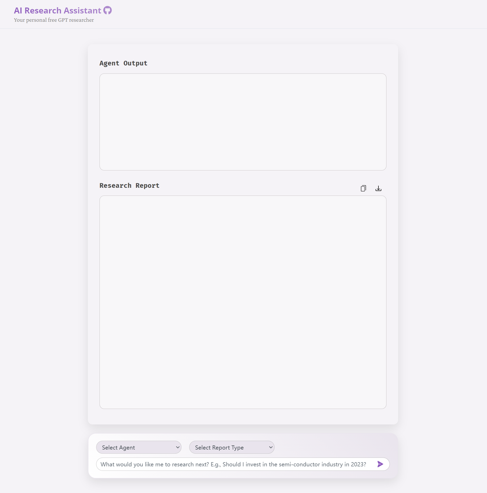

# AI Research Assistant

<div align="center">
    
</div>

Inspired by [gpt-researcher](https://github.com/assafelovic/gpt-researcher). 

This project offers an alternative approach to generating research reports by utilizing a third-party API instead of the official one. For access to this third-party API, please refer to [chimeragpt](https://chimeragpt.adventblocks.cc/). Once you obtain the API key, you can utilize it to access the chimeragpt API. Therefore, before running the project, kindly ensure that you set the environment variables `OPENAI_API_KEY` and `OPENAI_API_BASE`.

```
export OPENAI_API_KEY = your_api_key
export OPENAI_API_BASE = your_api_base
```

or you can set the api key and base in `.env` file.


## Installation

Please refer to the [installation guide](https://github.com/assafelovic/gpt-researcher#quickstart).

## TODO

- [x] Third-party API
- [ ] TBD