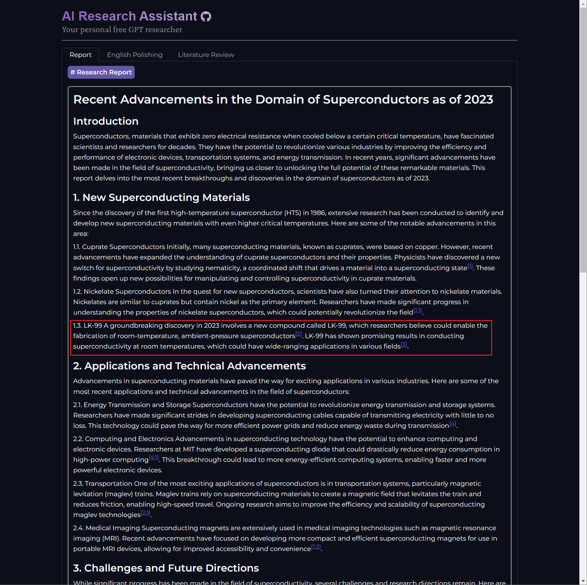
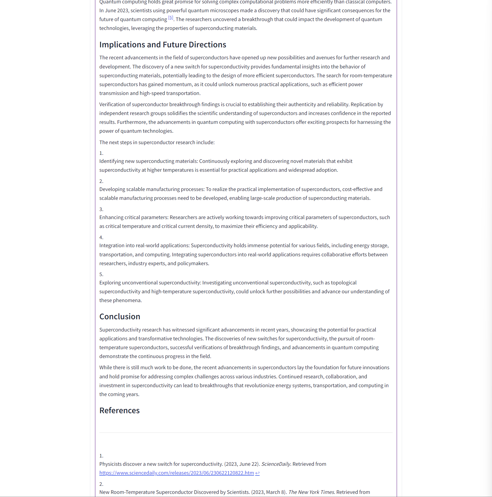
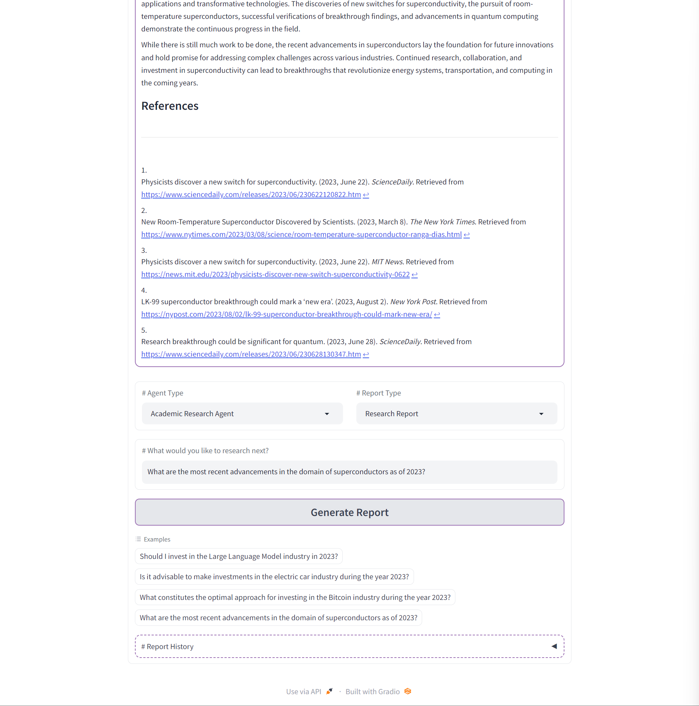

<div style="width: 100%;">
    
    <div align="right">
        <a href="./README.md">English</a> |
        <a href="./statics/README_zh.md">中文</a>
    </div>
</div>

> **15th Aug, 2023 Update: Fix HttpError. (Sorry for the late update. I'm currently working on my dissertation...)**


Inspired by [gpt-researcher](https://github.com/assafelovic/gpt-researcher). This project endeavors to develop an AI research assistant capable of **generating research reports** effortlessly for researchers. For instance, researchers can request the AI research assistant to compose a report on *the latest advancements in the field of superconductors as of 2023*, which is currently a trending topic. The AI research assistant will subsequently compile a report based on the relevant information obtained from the internet. Now, AIRA also offers support for **academic English polishing**.

<!-- make a table -->
|              Example1-1              |              Example1-2              |              Example1-3              |
| :----------------------------------: | :----------------------------------: | :----------------------------------: |
|  |  |  |

The currently supported agents encompass a wide range of fields, including *finance, business analysis, clinical medicine, basic medicine, travel, academic research and sociology*.

In addition to official api, this project offers an alternative approach to generating research reports by utilizing a third-party API. For access to this third-party API, please refer to [chimeragpt](https://chimeragpt.adventblocks.cc/) or [GPT-API-free](https://github.com/chatanywhere/GPT_API_free). Before running the project, kindly ensure that you set the environment variables `OPENAI_API_KEY` and `OPENAI_API_BASE`.

```shell
$ export OPENAI_API_KEY = your_api_key
$ export OPENAI_API_BASE = your_api_base
```

or you can set the api key and base in `.env` file.


## Installation

1. Clone the repository
    
    ```shell
    $ git clone git@github.com:paradoxtown/ai_research_assistant.git
    $ cd ai_research_assistant
    ```

2. Install the dependencies

    ```shell
    $ pip install -r requirements.txt
    ```

3. Export evnironment variables

    ```shell
    $ export OPENAI_API_KEY = your_api_key
    $ export OPENAI_API_BASE = your_api_base
    ```
    or modify the `.env` file.

4. Run the project

    ```shell
    $ python app.py
    ```

## TODO

- [x] Switch Google Search to DuckDuckGo
- [ ] Literature review
- [x] Third-party API
- [ ] Prettify report
- [x] Add medical agent and social agent
- [ ] Add option for users to customize the number of words and temperature
- [ ] Copy and download buttons
- [ ] Allows the user to choose the degree of research.
- [ ] Wikipedia Understanding

---

<div align="center">Happy researching! 🚀</div>